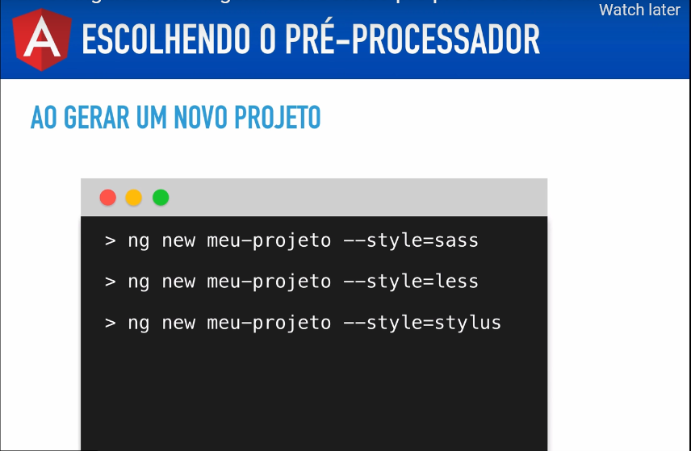
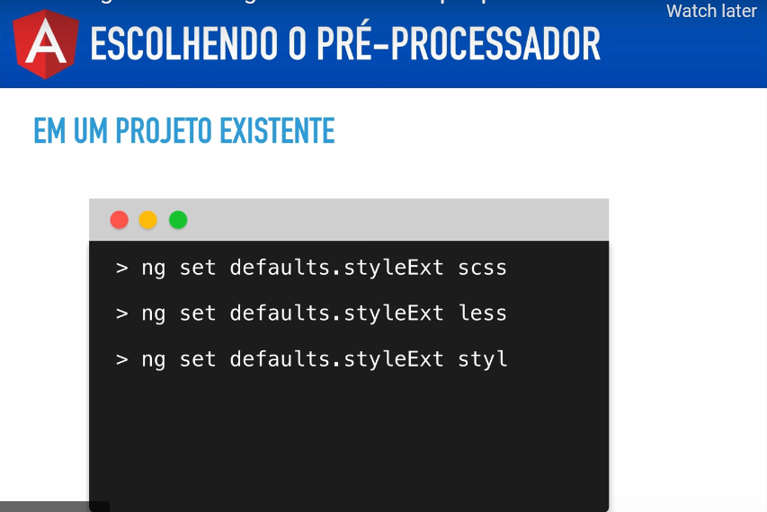

# Style Guide Angular
Este guia de [estilo](https://angular.io/guide/styleguide) apresenta as convenções preferidas e, o mais importante, explica o porquê.

# Aula 09 - Property Binding e Interpolação
A vinculação de dados do inglês([Data Binding](https://www.digitalocean.com/community/tutorials/angular-data-binding-angular)), é um conceito central em Angular e permite definir a comunicação entre um componente e o DOM, tornando muito fácil definir aplicativos interativos sem se preocupar em enviar e extrair dados.

* data-binding.component.html
```
<section class="property-binding">

    <article>
        <h3>Interpolation / Interpolação</h3>
        <p>String renderizada com interpolação: {{ url }}</p>
        <p>Resultado de 1 + 1 é: {{ 1 + 1 }}</p>
        <p>Resultado de 1 + 1 não é: {{ 1 + 1 + getValor()}}</p>
        <p>Curso de Angular e gosto do curso: {{ cursoAngular && getCurtirCurso() }}</p>
    </article>

    <article>
        <h3>Property Binding</h3>
             <!--Interpolação-->
                 <!--Property Binding-->
              <!--Binding Search-->
    </article>

    <!-- Property Binding 
     > Valor do Component para o Template
     > Usa-se colchetes 
     > Formato padrão é através de bind-nomePropriedade 
     > Quando não existe uma propriedade no elemento, usa-se [attr.colspan] OBS: Muito raro de ser usado
    -->

</section>
```
* data-binding.component.ts
```
import { Component, OnInit } from '@angular/core';

@Component({
  selector: 'app-data-binding',
  templateUrl: './data-binding.component.html',
  styleUrls: ['./data-binding.component.css']
})
export class DataBindingComponent implements OnInit {

  url: string = 'http://loiane.io';
  cursoAngular: boolean = true;
  urlImagem = 'https://picsum.photos/id/237/200/300';

  getValor() {
    return 1;
  }

  getCurtirCurso() {
    return true;
  }

  constructor() { }

  ngOnInit(): void {
  }

}
```

# Aula 10 - Class e Style Binding
A associação de estilo do inglês([Style Binding](https://angular.io/guide/attribute-binding)), é usada para definir um estilo de um elemento de exibição. Podemos definir os estilos embutidos de um elemento HTML usando a ligação de estilo em angular. Você também pode adicionar estilos condicionalmente a um elemento, criando assim um elemento com estilo dinâmico.

* data-binding.component.html
```
<article>
        <hr>
        <h1>Parte da Aula 10 - Class e Style Binding</h1>
        <h3>Class e Style Binding</h3>
        <div>
            Selecione uma classe:
            <select #classe (change)="0" > <!-- Variavel local de template para acessar os options -->
                <option value="alert-success">Sucesso</option>
                <option value="alert-info">Info</option>
                <option value="alert-warning">Alerta</option>
                <option value="alert-danger">Erro</option>
            </select>
            <br><br>

            <!-- Interpolação com Style Binding -->
            <div class="alert {{ classe.value }}" role="alert">
                Texto colorido conforme o valor do combox.
            </div>

            <!-- Property Binding de Classes -->
            <div class="alert" role="alert" 
                [class.alert-success]="classe.value == 'alert-success'">
                Sucesso
            </div>
            <div class="alert" role="alert" 
                [class.alert-info]="classe.value == 'alert-info'">
                Info
            </div>
            <div class="alert" role="alert"
                [class.alert-warning]="classe.value == 'alert-warning'">
                Alerta
            </div>
            <div class="alert" role="alert"
                [class.alert-danger]="classe.value == 'alert-danger'">
                Erro
            </div>

            <!-- Property Binding com estilo de classe -->
            <!-- O texto só vai ficar vermelho em caso de erro -->
            <div class="alert alert-danger" role="alert"
            [style.display]="classe.value == 'alert-danger' ? 'block' : 'none' "> <!-- Display block em caso que queira que esse texto apareça, e display nome em caso de que não queira que o texto apareça -->
                Erro com if ternario usando Style Binding
            </div>
        </div>
</article>
```

# Aula 11 - Event Binding
A associação de eventos do inglês([Event Binding](https://angular.io/guide/event-binding)), permite ouvir e responder às ações do usuário, como pressionamentos de tecla, movimentos do mouse, cliques e toques.

* data-binding.component.html
```
<section class="event-binding">

        <article>
            <h1>Parte da Aula 11 - Event Binding</h1>
            <h3>Event Binding</h3>
            <div>
                <p class="text-success">Eventos de clique</p>
                <!-- No Property Binding a gente usa colchetes[] para indicar para o Angular que a gente quer utilizar um Binding de propriedades, e no Event nós usamos parentes() -->
                <!-- Necessario criar um novo método no data-binding.components.ts -->
                <!-- Por trás dos panos o Angular esta usando o on-click -->
                <button (click)="botaoClicado()"
                class="btn btn-primary">
                    Me clique!
                </button>

                <br><br>
                <p class="text-success">Eventos para recuperar valores de input</p>
                <!-- Escutando eventos -->
                <!-- KeyUp para pegar o valor que ta sendo inputado nesse campo texto é preciso passar o evento para o método porém para fazer referencia ao evento é necessario colocar o sinal de dollar $ -->
                <input type="text" 
                    (keyup)="onKeyUp($event)"
                    (keyup.enter)="salvarValor(campoInput.value)" 
                    (blur)="salvarValor($any($event.target).value)" 
                    #campoInput   
                />
                <!-- KeyUp.Enter para salvar o valor digitador ao apertar enter -->
                <!-- Brur para escutar o evento de quando o campo perdi o foco, ou seja ao clicar em qualquer outro lugar -->

                <p>Valor atual: {{ valorAtual }}</p>
                <p>Valor salvo: {{ valorSalvo }}</p>

                <br><br>
                <p class="text-success">Eventos de mouse</p>
                <span 
                    (mouseover)="onMouseOverOut()"
                    (mouseout)="onMouseOverOut()"
                    [class.highlight]="isMouseOver">
                    Passe o mouse sobre mim
                </span>
                <!-- MouseOver para quando o mouse estiver me cima do texto -->
                <!-- MouseOut para quando o mouse sair de cima do texto -->

            </div>
        </article>

</section>
```
* data-binding.components.ts
```
import { Component, OnInit } from '@angular/core';

@Component({
  selector: 'app-data-binding',
  templateUrl: './data-binding.component.html',
  // styleUrls: ['./data-binding.component.css']
  // Template Inline com array de estilos, e nós podemos declarar cada estilo utilizando os templates de string do ECM script 2015 que é através da crase. OBS usar esse método apenas para um estilo, caso tenha varios CSS, use o styleUrls
  styles: [
    `
      .highlight {
      background-color: red;
      font-weight: bold;
      color: white;
      }
    `
  ]
})
export class DataBindingComponent implements OnInit {

  url: string = 'http://loiane.io';
  cursoAngular: boolean = true;
  urlImagem = 'https://picsum.photos/id/237/200/300';
  valorAtual: string = '';
  valorSalvo: any = '';
  isMouseOver: boolean = false;

  getValor() {
    return 1;
  }

  getCurtirCurso() {
    return true;
  }

  botaoClicado() {
    alert('Botão Clicado!');
  }

  // evento.target é do tipo HTMLInputElement
  onKeyUp(evento: KeyboardEvent) {
    // console.log((<HTMLInputElement>evento.target).value);
    this.valorAtual = (<HTMLInputElement>evento.target).value; // Mostrar no template
  }

  // Para salvar o valor digitado no input
  salvarValor(valor: any) {
    this.valorSalvo = valor;
  }

  // Ao passar o nouse em cima de algum elemento
  onMouseOverOut() {
    this.isMouseOver = !this.isMouseOver;
  }

  constructor() { }

  ngOnInit(): void {
  }

}
```

# Aula 12 - Two-Way Data Binding
A vinculação de dados bidirecional do inglês([Two-Way Data-Binding(https://angular.io/guide/two-way-binding)]), refere-se ao compartilhamento de dados entre uma classe de componente e seu modelo. Se você alterar os dados em um lugar, eles serão automaticamente reflacionados na outra extremidade. Por exemplo, se você alterar o valor da caixa de entrada(**input**), ele também atualizará o valor da propriedade anexada em uma classe de componente.

# Aula 13 - Input Properties
Decorador que marca um campo de classe como uma propriedade de entrada([input](https://angular.io/api/core/Input)) e fornece metadados de configuração. A propriedade de entrada está vinculada a uma propriedade DOM no modelo. Durante a detecção de alterações, o Angular atualiza automaticamente a propriedade de dados com o valor da propriedade DOM.

# Aula 14 - Output Properties
[@Output()](https://angular.io/guide/inputs-outputs) — uma função de decorador que marca a propriedade como uma forma de os dados irem do filho para o pai. newItemEvent —o nome do @Output() EventEmitter<string> —o tipo de @Output() . new EventEmitter<string>() — diz ao Angular para criar um novo emissor de evento e que os dados que ele emite são do tipo string.

# Aula 15 - Ciclo de vida (life-cycle) do Componente
Todo componente no angular tem um conjunto de eventos de ciclo de vida([lifecycle hooks](https://angular.io/guide/lifecycle-hooks)) que ocorrem quando um componente é criado, renderizado, tem o valor de suas propriedades alteradas ou é destruído. o Angular invoca uma séries de métodos (hooks), que são executados no momento em que esses eventos são acionados.

## Evento (HOOKS)
1. ngOnChanges
* Antes #2 e quando o valor property-binding é atualizado
2. ngOnInit
* Quando component é inicializado
3. ngDoCheck
* A cada ciclo de verificação de mudanças
4. ngAfterContentInit
* Depois de inserir conteúdo externo na view
5. ngAfterContentChecked
* A cada verificação de conteúdo inserido
6. ngAfterViewChecked
* A cada verificação de conteúdo / conteúdo filho
7. ngOnDestroy
* Antes da diretiva/component ser destruído

# Aula 16 - Acesso ao DOM e ao Template com [ViewChild](https://angular.io/api/core/ViewChild)
Decorador de propriedade que configura uma consulta de exibição. O detector de alterações procura o primeiro elemento ou a diretiva que corresponde ao seletor na view DOM. Se o DOM da exibição for alterado e um novo filho corresponder ao seletor, a propriedade será atualizada.

# Aula 17 - Angular CLI: Instalação e criação de projetos: ng new e ng serve
A [CLI Angular](https://angular.io/cli) é uma ferramenta de interface de linha de comando que você usa para inicializar, desenvolver, estruturar e manter aplicativos Angular diretamente de um shell de comando.

# Aula 18 - Angular CLI: Criando components, services: ng generate
[ng generate](https://angular.io/cli/generate) app-shell [ options ] ng g app-shell [ options ] Gera um shell de aplicativo para executar uma versão do lado do servidor de um aplicativo.

## Outros tipos de arquivos que podemos criar
1. Component
* > ng g c meu-component
2. Service
* > ng g s meu-serviço
3. Directive
* > ng g d minha-diretiva
4. Pipe
* > ng g p meu-pipe
5. Class
* > ng g class minha-classe
6. Interface
* > ng g i minha-interface
7. Enum
* > ng g e meu-enum

# Aula 19 - Angular CLI: Usando pré-processadores (Sass, Less, Stylus)
Um [pré-processador CSS](https://developer.mozilla.org/pt-BR/docs/Glossary/CSS_preprocessor) é um programa que permite você gerar CSS a partir de uma sintaxe única desse pré-processador. Os pré-processadores facilitam a manutenção do código, além de facultar um código limpo, utilizando vários arquivos para organizar os códigos e realizando a importação quando for necessário tornando os códigos CSS mais flexíveis e reutilizáveis.

**Como utilizar em um projeto já pronto ?**
* > ng config schematics.@schematics/angular:component.style scss

# Aula 19 - Angular CLI: Usando pré-processadores (Sass, Less, Stylus)
1. Exemplo 1 - Iniciando um projeto com os pré-processadores.


2. Exemplo 2 - Modificando o pré-processador para um outro.
